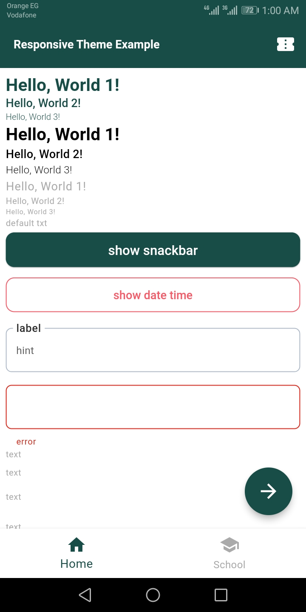
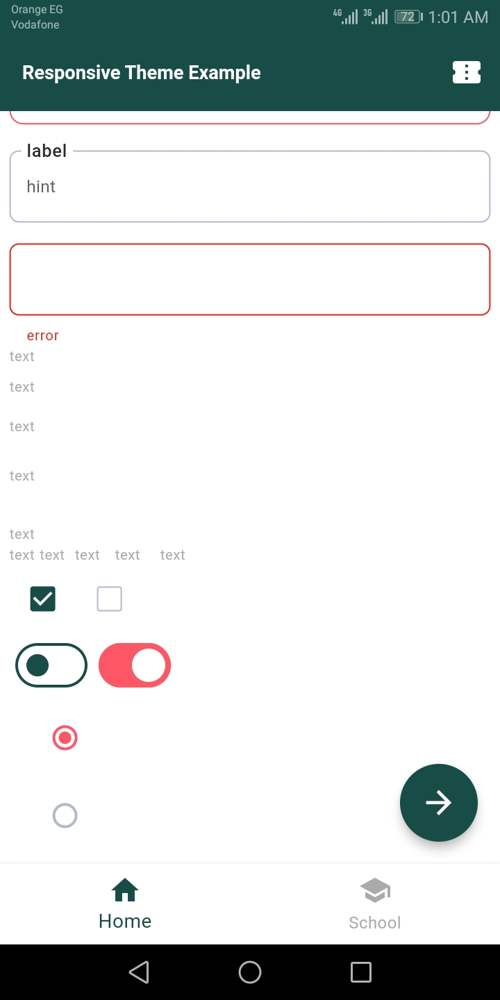
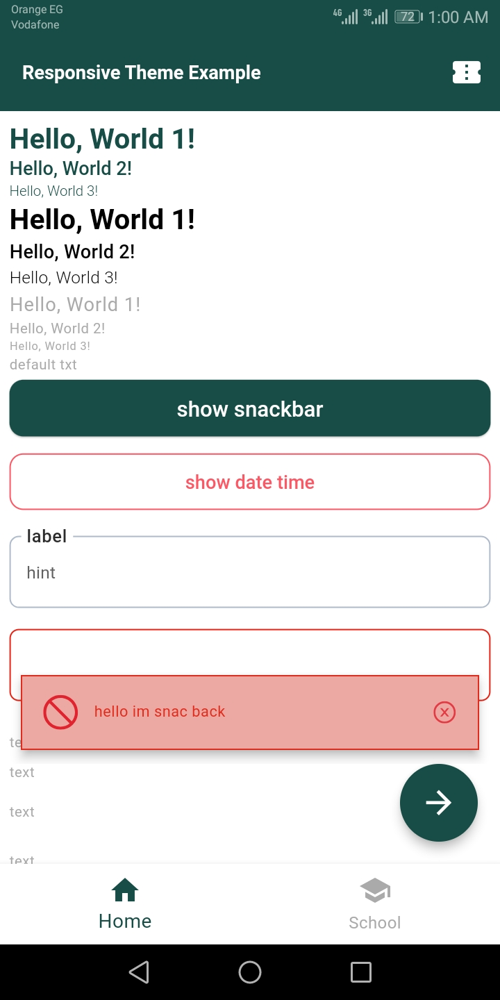
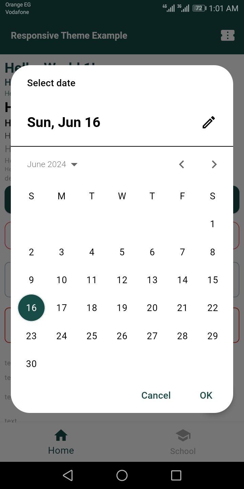

# AppTheme Package

[](https://pub.dev/packages/app_theme) [](https://github.com/your_github_username/app_theme/actions) [](https://opensource.org/licenses/MIT)

## Overview

`AppTheme` is a Flutter package designed to provide a comprehensive and responsive theming solution for your Flutter applications. This package includes a variety of themes for different UI components, ensuring a consistent look and feel across your app.

## Features

- **Light Theme**: Customizable light theme for various UI components.
- **Responsive Design**: Themes are responsive and adjust according to media query.
- **Component Themes**: Includes themes for AppBar, BottomNavigationBar, Checkbox, ElevatedButton, FloatingActionButton, InputDecoration, OutlinedButton, RadioButton, SnackBar, Switch, TabBar, and Text.
- **Color Scheme**: Centralized color management for a consistent color scheme across the app.

## Installation

Add the following to your `pubspec.yaml` file:

```yaml
dependencies:
  app_theme:
    path: packages/app_theme    
```
## Screenshots

---              |  --- 
:-------------------------:|:-------------------------:
  |  
  |  

